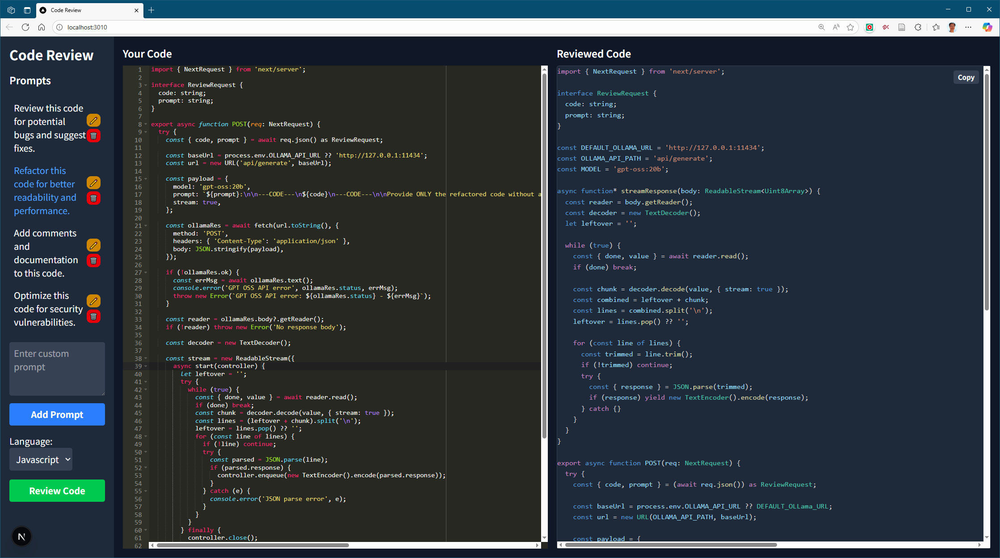

# Code Review JS

A web-based application for code review using AI. Built with Next.js and Tailwind CSS.

## Features

- **AI-Powered Review**: Utilizes the "[gpt-oss](https://ollama.com/library/gpt-oss)" model from the [Ollama server](https://ollama.com/) for intelligent code analysis.
- **Side-by-Side View**: Compare original and reviewed code side-by-side.
- **Streaming Response**: See the reviewed code as it's being generated by the AI.
- **Customizable Prompts**: Use default prompts or add your own custom prompts for code review. Your prompts are saved in your browser's local storage.
- **Syntax Highlighting**: Code editors with syntax highlighting for better readability.
- **Language Selection**: Select the language of your code for accurate syntax highlighting.
- **Copy to Clipboard**: Easily copy the reviewed code.
- **Loading and Error States**: Clear feedback during the code review process.

## Tech Stack

- [Next.js](https://nextjs.org/) - React framework for production.
- [Tailwind CSS](https://tailwindcss.com/) - A utility-first CSS framework.
- [React Ace](https://github.com/securingsincity/react-ace) - AceEditor component for React.
- [React Syntax Highlighter](https://github.com/react-syntax-highlighter/react-syntax-highlighter) - Syntax highlighter for react.

## Getting Started

To get a local copy up and running follow these simple steps.

### Prerequisites

- npm

  ```sh
  npm install npm@latest -g
  ```

### Installation

1. Clone the repo

   ```sh
   git clone https://github.com/your_username_/Project-Name.git
   ```

2. Install NPM packages

   ```sh
   npm install
   ```

3. Run the development server

   ```sh
   npm run dev
   ```

Open [http://localhost:3010](http://localhost:3010) with your browser to see the result.



### Building for Windows

To build a standalone Windows application using Electron:

1. **Ensure all processes are closed:** Before building, make sure no previous instances of the application are running and no file explorer windows are open in the project's `dist` directory or its subfolders. This is crucial to avoid file lock errors during the build process.
2. **Run the build command:**

    ```sh
    npm run electron-build
    ```

    This command will first build the Next.js application for production and then package it into a Windows executable using Electron.
3. **Find the executable:** The generated installer (`.exe` file) will be located in the `dist` directory (e.g., `dist\codereviewjs Setup 0.1.0.exe`).
